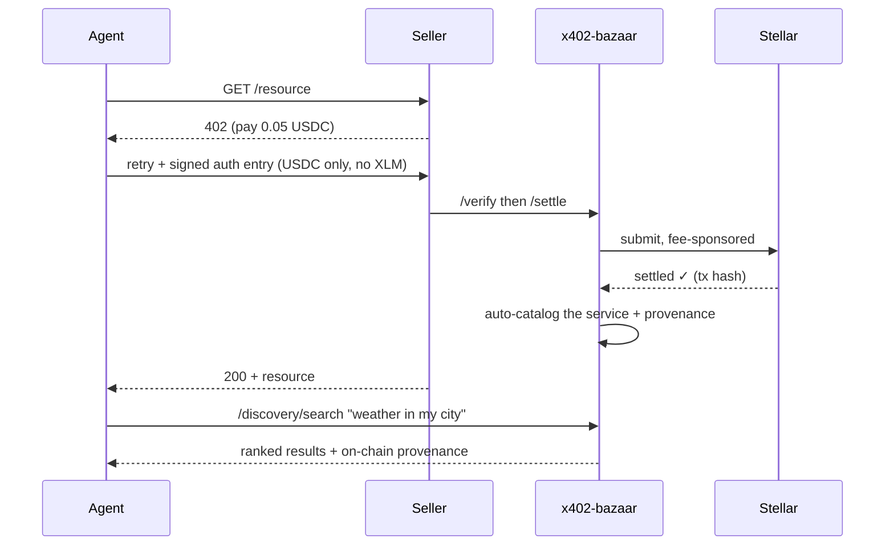

```
 ██
 ██▄███▄    ▄█████▄  ████████   ▄█████▄   ▄█████▄   ██▄████
 ██▀  ▀██   ▀ ▄▄▄██      ▄█▀    ▀ ▄▄▄██   ▀ ▄▄▄██   ██▀
 ██    ██  ▄██▀▀▀██    ▄█▀     ▄██▀▀▀██  ▄██▀▀▀██   ██
 ███▄▄██▀  ██▄▄▄███  ▄██▄▄▄▄▄  ██▄▄▄███  ██▄▄▄███   ██
 ▀▀ ▀▀▀     ▀▀▀▀ ▀▀  ▀▀▀▀▀▀▀▀   ▀▀▀▀ ▀▀   ▀▀▀▀ ▀▀   ▀▀

                            ▸ x402 · stellar
```

**The marketplace layer for the agent economy on Stellar.** Agents find a service, pay in USDC, and the catalog writes itself — one settled payment at a time.


[](docs/CONFORMANCE.md)
[](#search-quality-measured-not-asserted)
[](#how-it-works)
[](#license)
[](#try-it-yourself)

---

## In one sentence

The Stellar x402 stack can settle payments but has **no way to discover them**. x402-bazaar adds the missing layer: a self-hostable facilitator plus a **Bazaar** where agents browse, search in plain language, and pay — built on the Apache-2.0 `@x402/stellar` package, **live on testnet and mainnet**, Apache-2.0, no AGPL.

## Three things that make it real

| | |
|---|---|
| ⛓️ **Live on mainnet** | A real USDC payment settled on `stellar:pubnet` — tx [`07ecff0b…`](https://stellar.expert/explorer/public/tx/07ecff0b17403d4500e230f7f3d23cea347a495f1d3e0a193bb0cc2b0e275dbb), fees sponsored, non-custodial. Both networks the RFP calls committed deliverables are live. |
| 🛡️ **Optional PQ credential** | An optional post-quantum, anonymous agent-credential extension (verifier live on mainnet, source kept as private IP) — pay without revealing which agent you are. Not required to run the facilitator or Bazaar. [Details ↓](#-optional-extension-post-quantum-anonymous-agent-identity) |
| 🔎 **Search that works** | Natural-language ranking measured at **nDCG@10 0.833** on a committed eval set, not asserted. [Numbers ↓](#search-quality-measured-not-asserted) |

## Try it yourself

**▶ Live demo:** **[x402-bazaar-web-u87t.vercel.app](https://x402-bazaar-web-u87t.vercel.app/)** — browse the catalog, search in plain language, every entry links to its real on-chain settlement.

**▶ Plug it into your agent (remote MCP, one line):**

```sh
claude mcp add --transport http x402-bazaar https://x402-bazaar-web-u87t.vercel.app/api/mcp
```

Any streamable-HTTP MCP client works with the same URL (`{"mcpServers":{"x402-bazaar":{"url":"https://x402-bazaar-web-u87t.vercel.app/api/mcp"}}}`); stdio-only clients go through [`mcp-remote`](https://www.npmjs.com/package/mcp-remote). The remote server exposes `search_services` / `list_services` / `get_service` and is **read-only by design** — `paid_call`, which signs with your key, lives in the local stdio server (`packages/mcp-discovery`) so your private key never touches a shared endpoint.

Or run it locally in 30 seconds:

```sh
npm install
PORT=8402 npx tsx packages/facilitator/src/demo-server.ts
# open http://localhost:8402  — browse the catalog, search in plain language,
# every entry links to its real on-chain settlement
```

```sh
npm test          # 28 tests, no network
```

The demo is seeded with the actual services our conformance runs settled on-chain (mainnet + testnet + a non-USDC token + a contract-account payer). Every provenance link opens the real transaction on stellar.expert.

---

## 🛡️ Optional extension: post-quantum anonymous agent identity

*Optional — the facilitator and Bazaar above are the RFP deliverables and stand alone. This is a differentiating extension whose verifier is live on mainnet; its source is kept as private IP (access on request).*

An agent proves it belongs to an allowed set and pays — **without revealing which agent it is** — and the catalog counts **distinct credential holders**, not addresses, so provenance resists Sybil inflation where every other Bazaar's does not.

The credential is a **hash-based Circle-STARK**: no elliptic curves, no pairings, no trusted setup — **nothing Shor's algorithm can break**. Every other privacy/identity proof on Stellar today is BN254, which a quantum computer forges; this one it cannot.

- **The verifier is live on Stellar mainnet** (verifiable on-chain) — a working instance of the STARK candidate Stellar's own Quantum Preparedness Plan names for the ZK layer it hasn't solved. Its source (`pq402`) is maintained in a **private repository as protected IP** — this facilitator + Bazaar stand alone without it; access to the credential engine on request.
- **x402-bazaar ships the integration** — `packages/bazaar/src/credential.ts` (`CredentialVerifier`, `distinctCredentialHolders`); wiring the production pq402 verifier in is scheduled work.

> **Honest scope, because reviewers check:** the USDC *settlement* uses standard Soroban signatures (a Stellar-protocol concern the SDF's own QPP addresses). The post-quantum, anonymous part is the **agent-credential and provenance layer** — and that layer's quantum-proof verifier is real and live on mainnet in pq402 today.

---

## What works — every claim checkable on-chain

Six settlements through this facilitator, each verifiable (full evidence: [docs/CONFORMANCE.md](docs/CONFORMANCE.md)):

| # | network | what it proves | tx |
|---|---|---|---|
| 1 | testnet | stock `@x402` buyer, $0.05 USDC | `dae9569b…` |
| 2 | testnet | MCP agent discovers then pays (`paid_call`) | `904be536…` |
| 3 | testnet | custom `__check_auth` contract-account payer | `61f8872b…` |
| 4 | testnet | any SEP-41 token (non-USDC) | `21923053…` |
| 5 | testnet | `upto` metered: authorize → settle → replay-refused | contract `CBSYBSM6…` |
| **6** | **MAINNET** | **real USDC on `stellar:pubnet`** | [`07ecff0b…`](https://stellar.expert/explorer/public/tx/07ecff0b17403d4500e230f7f3d23cea347a495f1d3e0a193bb0cc2b0e275dbb) |

Every run: fees sponsored by the facilitator, the buyer spends the payment asset only (no XLM), funds move payer→recipient directly, and the resource is auto-cataloged with provenance.

## How it works

An agent hits a paid API and gets HTTP 402. It signs a Soroban auth entry for a USDC transfer — nothing else — and retries. The facilitator verifies and settles **using the upstream `@x402/stellar` package (not reimplemented)**, pays the network fee itself, and submits. If the payment carried the discovery extension, the catalog learns the service exists, and the next agent finds it in plain language.



<details>
<summary><b>Architecture &amp; design rule</b></summary>

```
packages/facilitator  (express) ── /verify /settle /supported  ─▶ ExactStellarScheme
                                    /discovery/resources|search    (@x402/stellar, upstream)
                                    /upto/settle · demo UI at /
packages/bazaar       (no HTTP) ── ingest (routeTemplate validation) · node:sqlite +
                                    provenance · search (BM25 ⊕ MiniLM via RRF) · credential gate
packages/mcp-discovery (stdio)  ── search · list · get · paid_call, for AI agents
contracts/            (Soroban) ── upto-authorization · ed25519-account (__check_auth)
```

**Build on upstream, never reinterpret it.** Wire shapes are the ones `@x402/core`'s `HTTPFacilitatorClient` actually sends, so any existing seller middleware works unchanged. Discovery validation uses the upstream spec functions; cataloging outcomes ride the `EXTENSION-RESPONSES` header. Any SEP-41 token, USDC by default (7 decimals). CAIP-2 networks `stellar:testnet` and `stellar:pubnet`.

Full diagrams: [docs/DIAGRAMS.md](docs/DIAGRAMS.md).
</details>

<details>
<summary><b>Search quality — measured, not asserted</b></summary>

On the committed eval harness (`eval/search-eval.ts` — 24 services, 16 agent-style queries, graded relevance):

| ranking | nDCG@10 | hit@1 |
|---|---|---|
| substring baseline | 0.524 | 6/16 |
| BM25 (zero-dependency default) | 0.497 | 9/16 |
| **hybrid BM25 + local MiniLM + RRF** (`EMBEDDINGS=local`) | **0.833** | **12/16** |

BM25 alone scores 0 when agent vocabulary diverges from catalog vocabulary ("will it rain" vs "weather forecast") — the published tool-retrieval failure mode ([ToolRet, arXiv:2503.01763](https://arxiv.org/abs/2503.01763)) reproduced on our data. Reproduce: `EMBEDDINGS=local npx tsx eval/search-eval.ts`.
</details>

<details>
<summary><b>Why this matters, and the problem it solves</b></summary>

Every x402 discovery layer today (Coinbase CDP, PayAI, 402.ad) is EVM-only; the one facilitator on Stellar is AGPL you cannot embed. And a naive Bazaar would import a measured problem: a population-scale study of x402 on Base ([arXiv:2607.12575](https://arxiv.org/abs/2607.12575)) found 21.2% of settlements fictitious and 63.8% internal to linked clusters. Settlement count is nearly free to manufacture, so a catalog that treats "has settlements" as "is real" becomes a directory of stalls selling to themselves.

x402-bazaar answers both: a facilitator anyone self-hosts under Apache-2.0, and **provenance** — distinct payers, and distinct *credential holders* — so rankers discount fake volume. Running a second independent facilitator against the upstream client also surfaced a real interop bug (ledger-close-time estimation causing `expiration_too_far`), reported upstream with a fix. Full claims discipline and prior-art comparison: [docs/CONFORMANCE.md](docs/CONFORMANCE.md).
</details>

<details>
<summary><b>Honest limits</b></summary>

- **Mainnet is live; the security review isn't yet.** A real pubnet settlement ran (tx `07ecff0b…`); a third-party Audit Bank review comes before any production mainnet tag.
- **`upto` is proven on-chain, not yet on the wire.** The contract ran its full cycle on testnet; the upstream spec PR and facilitator authorize-verify are scheduled.
- **The Sybil-resistant credential is wired, not yet backed by the live STARK verifier** (which exists in pq402); until then `distinctCredentialHolders` reads 0 and distinct-address provenance is the honest signal.
- **`node:sqlite` is experimental** (Node 22), isolated behind one interface.
</details>

## Documentation

- [docs/CONFORMANCE.md](docs/CONFORMANCE.md) — every settlement, on-chain, with hashes
- [docs/THREAT_MODEL.md](docs/THREAT_MODEL.md) — 10 findings, audit format
- [docs/DIAGRAMS.md](docs/DIAGRAMS.md) — Mermaid stack diagrams
- [docs/scheme_upto_stellar.md](docs/scheme_upto_stellar.md) — the `upto` network spec (draft for upstream)

## License

Apache-2.0. No AGPL or strong copyleft in the dependency path. First-party code is
Apache-2.0; dependencies are Apache-2.0/MIT, with one weak-copyleft native library
(`@img/sharp-libvips`, LGPL-3.0, pulled in dynamically via `@huggingface/transformers`)
that does not affect redistribution or self-hosting of this code.
