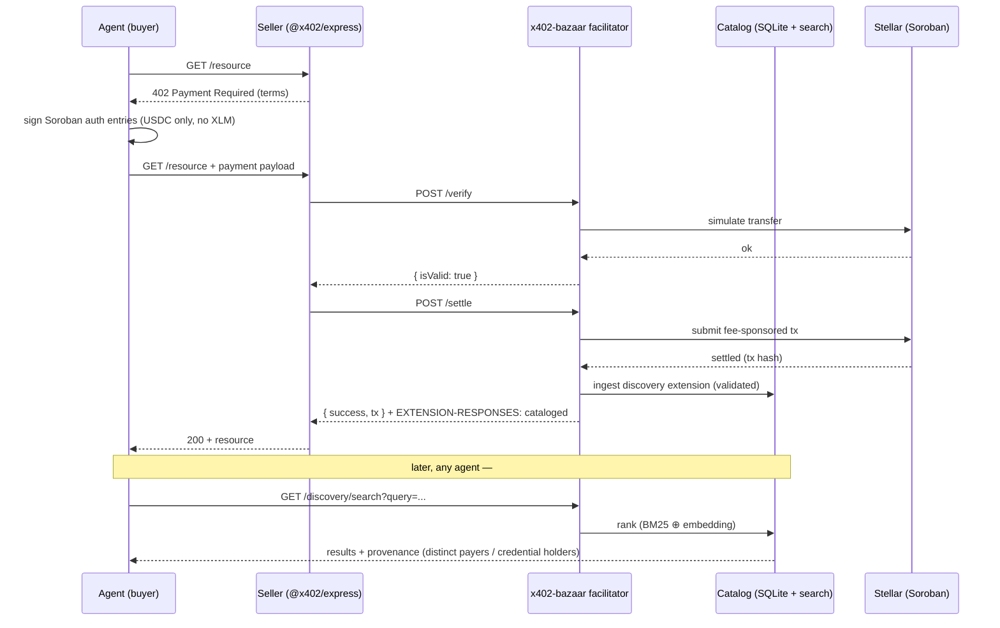
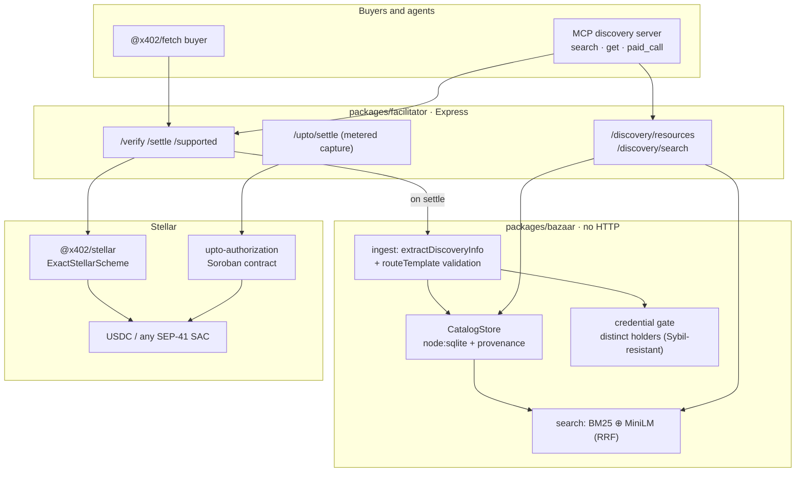
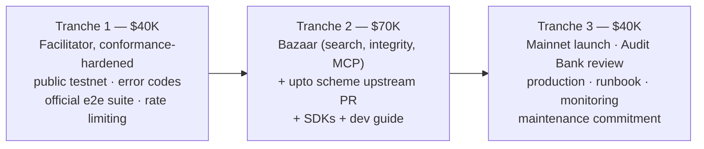

# x402-bazaar — technical stack diagrams (Mermaid)

For the SCF Build submission's "high-level visual diagram (Mermaid or similar) and a
plain-English explanation of the technical stack" requirement. Plain-English summary under
each diagram.

## 1. Payment + auto-cataloging flow

What happens end to end when an agent pays for a service and the catalog learns it exists.

**Plain English:** the buyer gets an HTTP 402, signs only an authorization for a USDC
transfer (no XLM, no account with the facilitator), and retries. The facilitator verifies
and settles on Stellar using the upstream `@x402/stellar` package — it does not
reimplement payment logic — and pays the network fee itself so the buyer needs only the
payment asset. If the payment carried discovery metadata, the catalog records the service
automatically. Any agent can then find it in natural language, with on-chain provenance
attached so fake volume can be discounted.

## 2. System architecture

The three packages and what each owns.

**Plain English:** `packages/facilitator` is the HTTP service (verify, settle, supported,
the upto capture endpoint, and the two discovery endpoints). `packages/bazaar` is a
pure library — no HTTP — that owns the catalog store, search, cataloging, and the
Sybil-resistant credential gate. Settlement itself is delegated to the upstream
`@x402/stellar` scheme (`exact`) and our small `upto` Soroban contract. Every arrow into
Stellar terminates at a token contract; the facilitator is never a party to the transfer.

## 3. Deliverable tranches

**Plain English:** three tranches totaling $150K, the largest on the Bazaar and the `upto`
scheme (the work the RFP itself calls "novel"), and the final tranche is the production
mainnet launch — de-risked because a real mainnet settlement is already live.
